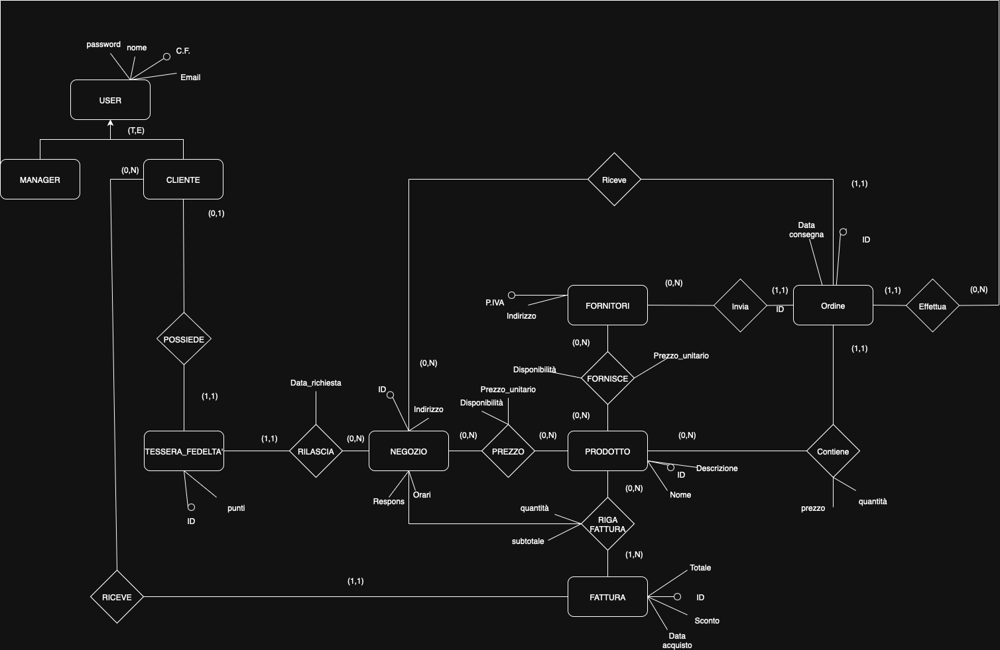

# Documentazione progetto
## Indice
- [Documentazione progetto](#documentazione-progetto)
  - [Indice](#indice)
  - [Introduzione](#introduzione)
  - [1. Schema-ER](#1-schema-er)
  - [2. Schema Logico](#2-schema-logico)
  - [3. Documentazione funzionalità](#3-documentazione-funzionalità)
    - [1. Trigger hash\_password](#1-trigger-hash_password)
    - [2. Trigger normalizeInput](#2-trigger-normalizeinput)
    - [3. Trigger validate\_fidelity\_card\_trigger](#3-trigger-validate_fidelity_card_trigger)
    - [4. View catalogo\_negozi](#4-view-catalogo_negozi)
    - [5. View tessere\_maggiori\_punti](#5-view-tessere_maggiori_punti)
    - [6. Trigger aggiorna\_punti\_fidelity\_trigger](#6-trigger-aggiorna_punti_fidelity_trigger)
    - [7. Funzione lista\_tessere\_rilasciate(negozio\_id INT)](#7-funzione-lista_tessere_rilasciatenegozio_id-int)
    - [8. Trigger convalida\_ordine\_prodotto](#8-trigger-convalida_ordine_prodotto)
    - [9.  Trigger aggiorna\_disponibilita\_prodotto\_fornitore](#9--trigger-aggiorna_disponibilita_prodotto_fornitore)
    - [10. View sconti\_clienti](#10-view-sconti_clienti)
    - [11. Trigger aggiungi\_prodotto\_negozio](#11-trigger-aggiungi_prodotto_negozio)
    - [12. Triggger aggiorna\_disponibilita\_prodotto\_negozio](#12-triggger-aggiorna_disponibilita_prodotto_negozio)
    - [13. Trigger aggiorna\_tessere\_negozi\_eliminati](#13-trigger-aggiorna_tessere_negozi_eliminati)
    - [14. Trigger Calcola\_subtotale\_riga\_fattura](#14-trigger-calcola_subtotale_riga_fattura)
    - [14. Trigger valida\_fattura()](#14-trigger-valida_fattura)
    - [15. View storico\_ordine\_approfondito](#15-view-storico_ordine_approfondito)
    - [16. Function storicoOrdiniFornitore](#16-function-storicoordinifornitore)
  - [4. Immagini funzionamento funzionalità richieste](#4-immagini-funzionamento-funzionalità-richieste)
    - [4.1 Aggiornamento saldo punti su tessera fedeltà](#41-aggiornamento-saldo-punti-su-tessera-fedeltà)
    - [4.2 Applicazione sconto sulla spesa](#42-applicazione-sconto-sulla-spesa)
    - [4.3 Lista tesserati dato un negozio](#43-lista-tesserati-dato-un-negozio)
    - [4.4 Saldo punti \> 300](#44-saldo-punti--300)
    - [4.5 Storico ordini a fornitori](#45-storico-ordini-a-fornitori)
    - [4.6 Mantenimento storico tessere](#46-mantenimento-storico-tessere)
    - [4.7 e 4.8 Ordine prodotti da fornitore e aggiornamento disponibilità prodotti da fornitore](#47-e-48-ordine-prodotti-da-fornitore-e-aggiornamento-disponibilità-prodotti-da-fornitore)

## Introduzione
Il seguente progetto è stato creato secondo le specifiche dell'anno 2025/2026 per il corso di Basi di dati.
Riguarda la creazione di un gestionale di negozi e fornitori che permetta l'uso sia da parte di un manager (per gestire i vari negozi e fornitori oltre che i prodotti presenti), sia per i clienti che potranno acquistare prodotti dai vari negozi usufruendo degli sconti in caso richiedessero una tessera fedeltà ad un negozio.

## 1. Schema-ER

Lo schema ER ha subito una ristrutturazione per quanto riguarda la gerarchia di generalizzazione tra **Clienti** e **Manager** (gerarchia **User**), le due entità sono state suddivise in modo da permetterne un'implementazione facilitata (andando anche a suddividere meglio le relazioni non in comune tra le due).
Un'altra ristrutturazione riguarda invece la relazione __Ordine__, questa relazione è stata trasformata in un'entità a parte avente relazioni differenti con le entità **Fornitori**, **Manager**, **Negozio** e **Prodotto**.

## 2. Schema Logico
Per gli schemi logici di ogni tabella adotterò questi simboli:
- 'Grassetto'->Primary key 
- '*'-> per valori nullable
- 'Corsivo' -> per Foreign Keys

1. cliente(**c_f**,nome,email,password) e manager(**c_f**,nome,email,password):
  in queste entità c_f è la chiave primaria mentre l'email è unica, non possono esserci quindi tuple con la stessa email.

2. prodotti(**id**,name,description)
  rileggendo la consegna, description sembra essere un elemento indispensabile e non può quindi essere nullo, id è la chiave primaria.

3. negozi(**id**,name,address,responsabile,orario_apertura,orario_chiusura)
   
4. fatture(**id**,*cliente*,sconto,data_emissione,totale)
   Questa entità presenta una foreign key (cliente) con vincolo ON DELETE CASCADE, inoltre lo sconto e il totale presentano entrambe un vincolo di dominio CHECK(>=0).
  
5. fornitori(**p_iva**,name,indirizzo)

6. fidelity_card(**id**,*cliente*,punti,*negozio*,data_rilascio)
   l'attributo punti presenta un vincolo di dominio >=0.
  
7. prodotto_negozio(**(*prodotto*,*negozio*)**,prezzo_unitario,disponibilita)
   Rappresenta la relazione **possiede** tra negozio e prodotto. La primary key è formata da prodotto e negozio, inoltre prezzo_unitario e disponibilita presentano vincoli di dominio >=0.
  
8. prodotto_fornitore(**(*prodotto*,*fornitore*)**,prezzo_unitario,disponibilita)
   Come prodotto_negozio ma rappresenta la tabella dei prodotti posseduti dai vari fornitori.

9.  ordini(**id**,*fornitore*,*manager_richiedente*,*negozio*,*prodotto*, quantita, prezzo, data_consegna)
   Questa entità rappresenta gli ordini dei singoli prodotti effettuata presso i vari fornitori, l'eliminazione di una qualsiasi delle foreign key comporta la cancellazione dell'ordine, per quantita e prezzo vale sempre il vincolo di dominio >=0.

10. riga_fattura(**(*fattura*,*prodotto*,*negozio*)**,quantita,subtotale*)
    per quantita e subtotale vale il vincolo di dominio >=0, mentre la primary key è composta da fattura, prodotto e negozio, è presente inoltre una foreign key formata da prodotto e negozio che impedisce di aggiungere tuple che hanno prodotti non appartenenti al negozio indicato.

11.    storico_tessere(**tessera_id_originale**,negozio_id,negozio_nome,*cliente*,punti,data_rilascio,data_eliminazione_negozio)

## 3. Documentazione funzionalità
Le varie funzionalità (trigger, viste, funzioni) saranno elencate seguendo l'ordine del file init.sql:

### 1. Trigger hash_password
  Usato per clienti e manager, va a fare l'hashing della password prima dell'inserimento nelle rispettive tabelle, utilizza la funzione *md5* di psql.

### 2. Trigger normalizeInput 
  usato per poter normalizzare email e codice fiscale con LOWER e UPPER

### 3. Trigger validate_fidelity_card_trigger 
  Permette, attraverso la sua funzione di validazione, di controllare se i punti della fidelity card da inserire sono >0 e se il negozio e il cliente inseriti esistono prima che la tessera possa essere inserita nella sua tabella.

### 4. View catalogo_negozi
  View che permette di avere un catalogo con descrizione per ogni negozio dei prodotti facendo una join tra negozi, prodotto_negozio e prodotti.

### 5. View tessere_maggiori_punti 
  View che restituisce i clienti con una tessera fedeltà avente più di 300 punti.

### 6. Trigger aggiorna_punti_fidelity_trigger 
  Un trigger che, attraverso la sua funzione **aggiorna_punti_fidelity**, controlla, ad ogni fattura inserita, se il cliente possiede una tessera fedeltà, in caso fosse così va ad aumentare il saldo punti come da specifiche.

### 7. Funzione lista_tessere_rilasciate(negozio_id INT)
  Questa funzione ha come parametro *negozio_id* e va a restituire la lista delle tessere rilasciate dallo stesso, in caso non fossero presenti tessere allora avremo una tabella vuota.

### 8. Trigger convalida_ordine_prodotto 
  Questo trigger utilizza la funzione convalida_ordine_prodotto() prima dell'inserimento di una tupla nella tabella ordini, quando questi vengono inseriti la funzione ricerca il fornitore avente il prezzo più basso e con disponibilità >= alla quantita di prodotto richiesto (viene utilizzato un limit 1 per prendere il primo fornitore in caso ci fossero fornitori con stesso prezzo e abbastanza disponibilita) successivamente viene calcolato il totale e viene aggiunto il fornitore alla tupla (se presente, altrimenti il tutto viene annullato con una exception).

### 9.  Trigger aggiorna_disponibilita_prodotto_fornitore
  Questo trigger va a modificare la disponibilità di un certo prodotto presso un certo fornitore dopo l'inserimento dell'ordine (i controlli sulla disponibilità sono stati già fatti dal trigger precedente)

### 10. View sconti_clienti
  Restituisce una tabella con gli sconti utilizzabili dai vari clienti in base al loro punteggio (se possiedono una carta fedeltà), l'utilizzo di una view permette al cliente di scegliere se utilizzare o no lo sconto a lui concesso (oltre a fare i relativi controlli).

### 11. Trigger aggiungi_prodotto_negozio
  Questo trigger permette, all'inserimento di un ordine, di andare ad aggiungere nella tabella prodotto_negozio il prodotto ordinato da un certo negozio se il negozio non lo possiede ancora altrimenti va a modificare la quantità di prodotto presente in quel negozio.

### 12. Triggger aggiorna_disponibilita_prodotto_negozio
  Questo trigger va a diminuire la quantità di un prodotto posseduto da un negozio ogni volta che viene fatta una insert in *riga_fattura*.

### 13. Trigger aggiorna_tessere_negozi_eliminati
  Questo trigger si attiva prima dell'eliminazione di un negozio dalla tabella negozi, va a salvare tutte le tessere del negozio che sta per essere eliminato in una tabella di storico (i punti sulle tessere non potranno essere più utilizzati e i clienti dovranno richiederne di nuove), assieme ad esse sarà salvato anche id e nome del negozio,oltre che la data di eliminazione dello stesso.

### 14. Trigger Calcola_subtotale_riga_fattura
  Questo trigger calcola internamente al db il subtotale per la riga_fattura che deve essere inserita, così da mantenere integrità rispetto al prezzo del negozio e alla quantità ed evitando che possano essere aggiunti valori inadeguati (-1 o 0). Il controllo della presenza del prodotto in un certo negozio viene fatto dalla foreign key della tabella riga_fattura.

### 14. Trigger valida_fattura()
  Il trigger valida_fattura si attiva prima dell'inserimento di una fattura, questa avrà già lo sconto richiesto inserito. Valida fattura va quindi a controllare se lo sconto inserito è disponibile per il cliente e in caso lo applica al totale (aggiornato con NEW.totale=) e andrà a decurtare i punti necessari allo sconto dalla tessera, in caso non fosse presente alcuna tessera fedeltà allora non verrà applicato alcuno sconto.

### 15. View storico_ordine_approfondito
  Una view che restituisce lo storico ordine dei fornitori con approfondimenti riguardanti il fornitore stesso, il prodotto e il negozio.

### 16. Function storicoOrdiniFornitore
  Funzione che, in base alla p_iva inserita, restituisce lo storico ordini approfondito del fornitore a cui appartiene, utilizza la view **storico_ordine_approfondito**.

## 4. Immagini funzionamento funzionalità richieste
  ### 4.1 Aggiornamento saldo punti su tessera fedeltà
  Con tessera vuota:
    
  Durante processo:
    
  Processo completato:
    
  ### 4.2 Applicazione sconto sulla spesa
  Con tessera vuota o senza tessera:
  

  Aggiunta punti tessera:
  

  Inserimento fattura:
  

  Decurtazione punti:
  

  ### 4.3 Lista tesserati dato un negozio
   

  ### 4.4 Saldo punti > 300
  Punti prima:
  
  Tessere > 300:
  

  ### 4.5 Storico ordini a fornitori
  Ordini totali:
  

  Ordini fornitore 'IT11111111111':
  

  ### 4.6 Mantenimento storico tessere
  Cosiderando:
  
  Elimino il negozio 2:
  
  Tabella di storico:
  
  Tessere rimaste:
  
  E il prezzo da tutti i fornitori:
  

  Ordino 365 unità di questo prodotto per il negozio 1 che attualmente ha 150 unità:
  

  La funzione ha scelto il prodotto dal fornitore con prezzo_unitario minore ovvero:
  

  Controlliamo ora la disponibilità aggiornata dal negozio:
  

  E dal fornitore:
  